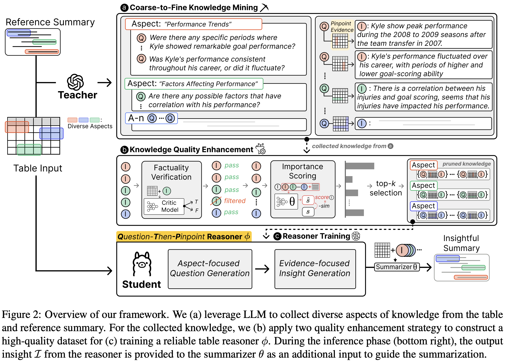

## Question-Then-Pinpoint  
[[**📖 arXiv**](https://arxiv.org/abs/2406.12269)]  

The data and code for the paper [Unveiling Implicit Table Knowledge with Question-Then-Pinpoint
Reasoner for Insightful Table Summarization](https://arxiv.org/abs/2406.12269).  

## Overview 
<p align="center">

</p>  

## Usage  
```
# QtP reasoner input preprocess for training (InsTaSumm)
sh scripts/reasoner_input_preprocess.sh
# QtP reasoner instruction tuning (InsTaSumm)
sh scripts/reasoner_train.sh
```

```
# QtP reasoner insight inference (InsTaSumm)
sh scripts/reaonser_inference.sh
```

```
# Summary inference with generated insight (InsTaSumm)
sh scripts/summary_inference.sh
```

## Citation

If you find our work useful, please kindly cite the paper:  
```
@inproceedings{seo-etal-2024-unveiling,
    title = "Unveiling Implicit Table Knowledge with Question-Then-Pinpoint Reasoner for Insightful Table Summarization",
    author = "Seo, Kwangwook  and
      Yeo, Jinyoung  and
      Lee, Dongha",
    editor = "Al-Onaizan, Yaser  and
      Bansal, Mohit  and
      Chen, Yun-Nung",
    booktitle = "Findings of the Association for Computational Linguistics: EMNLP 2024",
    month = nov,
    year = "2024",
    address = "Miami, Florida, USA",
    publisher = "Association for Computational Linguistics",
    url = "https://aclanthology.org/2024.findings-emnlp.719/",
    doi = "10.18653/v1/2024.findings-emnlp.719",
    pages = "12337--12362",
    abstract = "Implicit knowledge hidden within the explicit table cells, such as data insights, is the key to generating a high-quality table summary. However, unveiling such implicit knowledge is a non-trivial task. Due to the complex nature of structured tables, it is challenging even for large language models (LLMs) to mine the implicit knowledge in an insightful and faithful manner. To address this challenge, we propose a novel table reasoning framework Question-then-Pinpoint. Our work focuses on building a plug-and-play table reasoner that can self-question the insightful knowledge and answer it by faithfully pinpointing evidence on the table to provide explainable guidance for the summarizer. To train a reliable reasoner, we collect table knowledge by guiding a teacher LLM to follow the coarse-to-fine reasoning paths and refine it through two quality enhancement strategies to selectively distill the high-quality knowledge to the reasoner. Extensive experiments on two table summarization datasets, including our newly proposed InsTaSumm, validate the general effectiveness of our framework."
}
```
